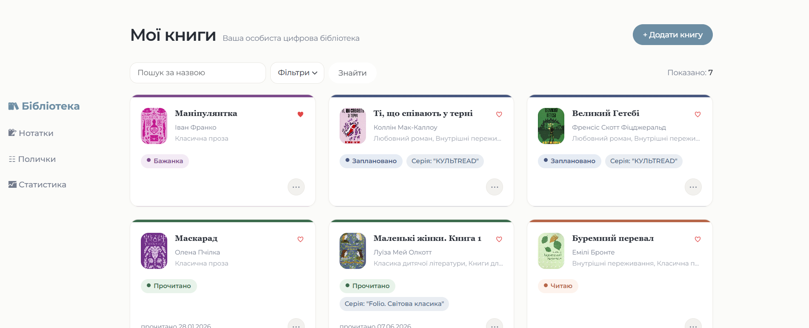
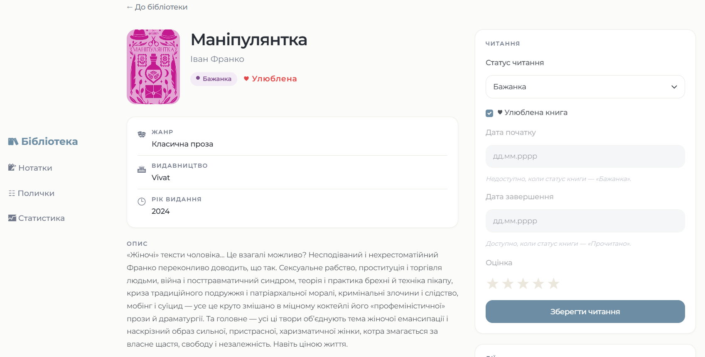
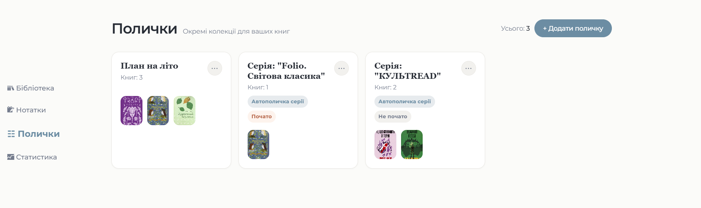
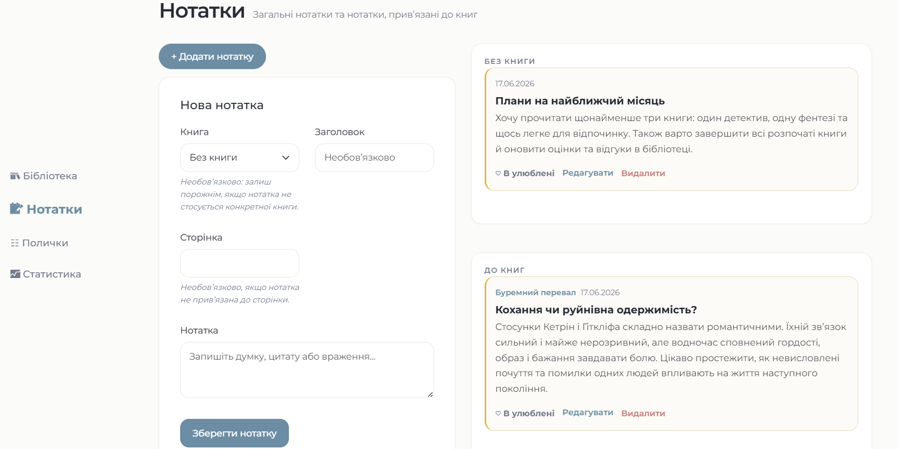
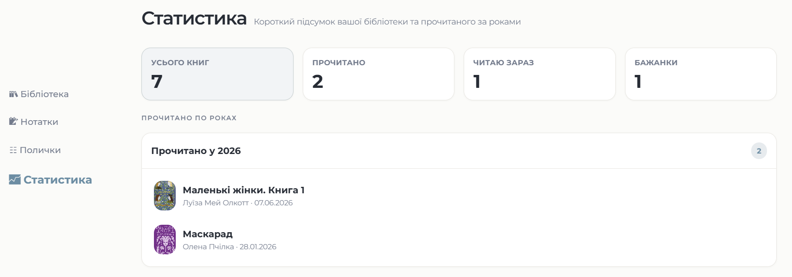
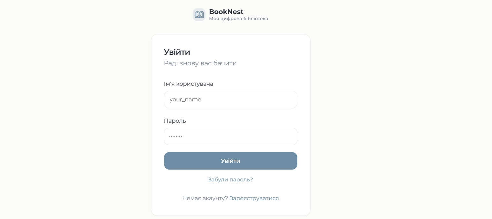

# 📚 BookNest

Персональний менеджер бібліотеки / Personal library manager.  
Built with **Python, Django, Django Templates, Bootstrap, HTML/CSS and PostgreSQL-ready deployment**.

<p align="center">
  <a href="https://booknest-j0pb.onrender.com">
    
  </a>
  
  
  
</p>

<p align="center">
  <a href="#-українська-версія">Українська</a> · <a href="#-english-version">English</a>
</p>

---

## 🇺🇦 Українська версія

## Про проєкт

**BookNest** — це вебзастосунок для ведення персональної цифрової бібліотеки. Користувач може додавати книги, відстежувати прогрес читання, створювати полички, писати нотатки, позначати важливе та переглядати статистику прочитаного.

Проєкт розроблений як портфоліо-застосунок, що демонструє повний цикл створення Django-застосунку: від моделей і CRUD-логіки до авторизації, фільтрів, інтерфейсу, тестів і деплою.

### Демо

➡️ **[Відкрити BookNest](https://booknest-j0pb.onrender.com)**

---



---

## Технології

| | | | | | | |
|---|---|---|---|---|---|---|
|  |  |  |  |  |  |  |

---

## Основні сторінки та можливості

### Бібліотека книг



- додавання книг вручну або через пошук;
- збереження назви, автора, жанру, видавництва, серії, року видання, опису та обкладинки;
- статуси читання: **Бажанка**, **Заплановано**, **Читаю**, **Прочитано**, **Закинуто**;
- оцінювання прочитаних книг;
- позначення книг як улюблених;
- пошук і фільтрація за статусом, жанром, видавництвом та улюбленими.

### Полички



- створення власних поличок;
- керування книгами всередині полички;
- автоматичні полички для книжкових серій;
- прев’ю полички з двома рядами обкладинок;
- фільтри всередині кожної полички.

### Нотатки



- загальні нотатки;
- нотатки до конкретної книги;
- номер сторінки для цитат або важливих фрагментів;
- редагування та видалення нотаток;
- улюблені нотатки, які підіймаються вище у списку.

### Статистика



- загальна кількість книг;
- кількість прочитаних книг;
- кількість книг у процесі читання;
- кількість книг у бажанках;
- автоматичні списки прочитаних книг за роками;
- згортання та розгортання списків за роками.

### Акаунт



- реєстрація користувача;
- вхід і вихід з акаунта;
- ізоляція даних між користувачами;
- відновлення пароля через електронну пошту.

---

## Чому цей проєкт цікавий

BookNest вирішує реальну користувацьку задачу — допомагає організувати особисту бібліотеку, плани читання, книжкові серії та нотатки.

Проєкт демонструє не лише backend-логіку, а й увагу до UX: зручну навігацію, фільтри, зрозумілі статуси, статистику, автоматичні списки та адаптивний інтерфейс.

---

## Що демонструє проєкт

- моделі Django та зв’язки між ними;
- CRUD для книг, нотаток і поличок;
- автентифікацію користувачів;
- відновлення пароля через електронну пошту;
- пошук і фільтрацію даних;
- роботу з файлами обкладинок;
- перевикористання шаблонів та компонентів інтерфейсу;
- адаптивну верстку;
- статистику на основі користувацьких даних;
- автоматизовані тести;
- конфігурацію, готову до деплою.

---

## Архітектура

```text
BookNest/
├── backend/                 # налаштування Django-проєкту
├── library/                 # основний застосунок
│   ├── models.py            # книги, полички, нотатки
│   ├── views.py             # сторінки та бізнес-логіка
│   ├── forms.py             # форми для книг, нотаток, поличок
│   ├── templates/library/   # UI сторінок бібліотеки
│   └── tests.py             # тести застосунку
├── templates/registration/  # авторизація та відновлення пароля
├── static/css/              # стилі інтерфейсу
├── render.yaml              # конфігурація деплою на Render
└── manage.py
```

---

## Запуск локально

```bash
git clone <repository-url>
cd BookNest
python -m venv .venv
source .venv/bin/activate
pip install -r requirements.txt
python manage.py migrate
python manage.py runserver
```

Локальна адреса:

```text
http://127.0.0.1:8000/
```

---

## Тести

```bash
python manage.py test
python manage.py check
```

---

## Подальший розвиток

- графіки статистики;
- цілі читання на рік;
- експорт бібліотеки у CSV/PDF;
- публічний профіль читача;
- темна тема;
- покращений імпорт книг із зовнішніх джерел.

---

## 🇬🇧 English version

## About

**BookNest** is a personal digital library web application. It helps users manage books, track reading progress, organize shelves, write notes, mark important items and view reading statistics.

The project was built as a portfolio-ready Django application that demonstrates the full development flow: data models, CRUD operations, authentication, filtering, UI templates, tests and deployment.

### Live Demo

➡️ **[Open BookNest](https://booknest-j0pb.onrender.com)**

---


---

## Tech Stack

| | | | | | | |
|---|---|---|---|---|---|---|
|  |  |  |  |  |  |  |

---

## Main Pages and Features

### Book Library


- add books manually or via search;
- store title, author, genre, publisher, series, publication year, description and cover;
- reading statuses: **Wishlist**, **Planned**, **Reading**, **Completed**, **Dropped**;
- rate completed books;
- mark books as favorites;
- search and filter by status, genre, publisher and favorites.

### Shelves


- create custom shelves;
- manage books inside shelves;
- automatic shelves for book series;
- two-row cover preview on shelf cards;
- filters inside each shelf.

### Notes

- general notes;
- book-specific notes;
- page number for quotes or important fragments;
- edit and delete notes;
- favorite notes that move to the top of the list.

### Statistics


- total number of books;
- completed books count;
- currently reading count;
- wishlist count;
- automatically generated yearly lists of completed books;
- collapsible yearly sections.

### Account


- user registration;
- login and logout;
- user-specific private data;
- email-based password reset.

---

## Why this project is useful

BookNest solves a real personal productivity problem: keeping books, reading plans, series and notes organized in one place.

It also demonstrates practical product thinking: clear navigation, useful filters, reading statuses, statistics, automatic grouping and a responsive user interface.

---

## What the project demonstrates

- Django models and relationships;
- CRUD for books, notes and shelves;
- user authentication;
- email-based password reset;
- search and filtering;
- file handling for book covers;
- reusable template components;
- responsive layout;
- user-based statistics;
- automated tests;
- deployment-ready configuration.

---

## Architecture

```text
BookNest/
├── backend/                 # Django project settings
├── library/                 # main application
│   ├── models.py            # books, shelves, notes
│   ├── views.py             # pages and business logic
│   ├── forms.py             # book, note and shelf forms
│   ├── templates/library/   # library UI templates
│   └── tests.py             # application tests
├── templates/registration/  # auth and password reset templates
├── static/css/              # interface styles
├── render.yaml              # Render deployment config
└── manage.py
```

---

## Local setup

```bash
git clone <repository-url>
cd BookNest
python -m venv .venv
source .venv/bin/activate
pip install -r requirements.txt
python manage.py migrate
python manage.py runserver
```

Local URL:

```text
http://127.0.0.1:8000/
```

---

## Tests

```bash
python manage.py test
python manage.py check
```

---

## Future improvements

- reading statistics charts;
- yearly reading goals;
- CSV/PDF library export;
- public reader profile;
- dark mode;
- improved book import from external sources.