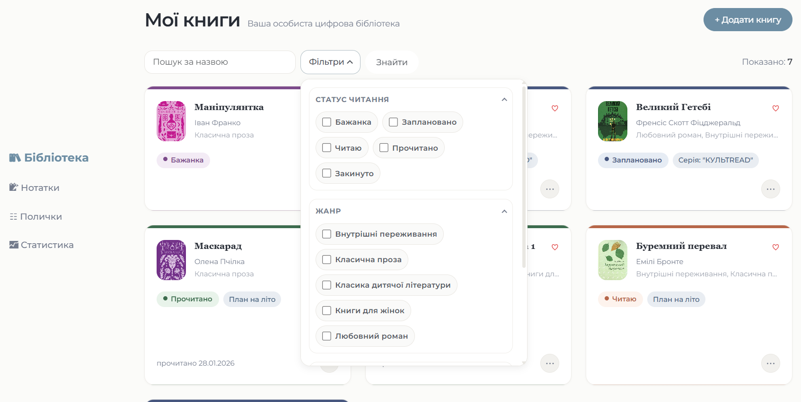
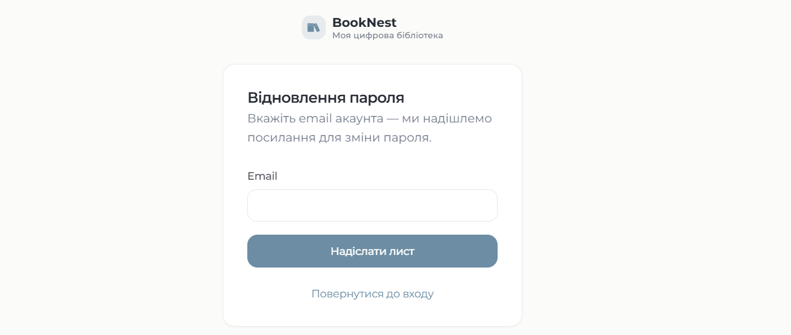
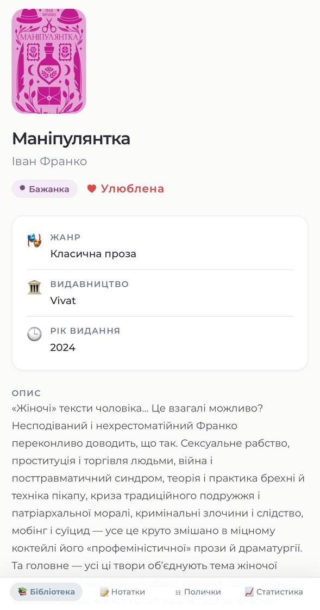
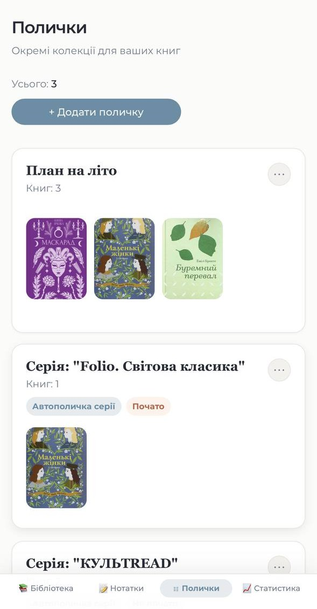
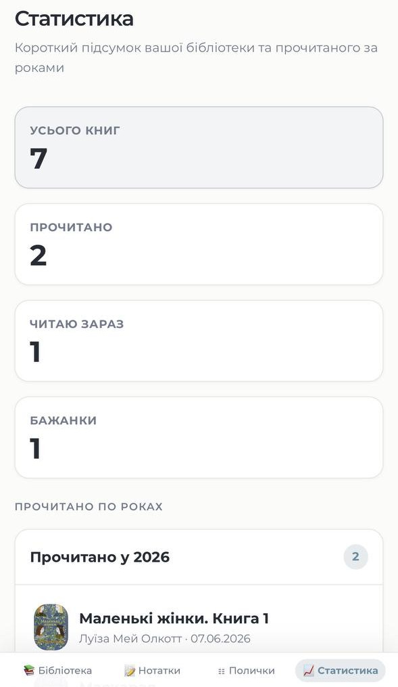

# 📚 BookNest

A personal digital library manager built with **Python, Django, Django Templates, Bootstrap, HTML/CSS**, and deployment settings that are ready for **Render + PostgreSQL**.

<p align="center">
  <a href="https://booknest-j0pb.onrender.com">
    
  </a>
  
  
  
</p>

<p align="center">
  <a href="README.uk.md">Українська версія</a> ·
  <a href="#live-demo">Live Demo</a> ·
  <a href="#technical-highlights">Technical Highlights</a> ·
  <a href="#local-setup">Setup</a> ·
  <a href="#tests-and-quality">Tests</a>
</p>

---

## About

**BookNest** is a personal digital library web application. It helps users manage books, track reading progress, organize shelves, write notes, mark important items, and view reading statistics.

The project was built as a portfolio-ready Django application that demonstrates the full development flow: data modeling, CRUD operations, authentication, filtering, form validation, responsive templates, automated tests, and deployment configuration.

## Live Demo

➡️ **[Open BookNest](https://booknest-j0pb.onrender.com)**

### Demo credentials

Use the seeded demo account to explore the deployed app:

```text
Username: demo
Password: demo12345
```

---


---

## Tech Stack

| Area | Technology |
|---|---|
| Backend | Python 3.12+, Django |
| Frontend | Django Templates, Bootstrap, HTML5, custom CSS |
| Database | SQLite for local development, PostgreSQL-ready for deployment |
| Authentication | Django authentication views and user-owned data isolation |
| External data | Book lookup through an external books API |
| Deployment | Render configuration via `render.yaml` |
| Testing | Django `TestCase` suite for core application flows |

---

## Feature Overview

### Book Library


- add books manually or through external search;
- store title, author, genre, publisher, series, description, and cover;
- manage reading statuses: **Wishlist**, **Planned**, **Reading**, **Completed**, **Dropped**;
- rate completed books;
- mark books as favorites;
- search and filter by status, genre, publisher, and favorites.



### Shelves


- create custom shelves;
- manage books inside shelves;
- automatically generate shelves for book series;
- show a two-row cover preview on shelf cards;
- filter books inside each shelf.

### Notes


- create general notes;
- attach notes to specific books;
- store page numbers for quotes or important fragments;
- edit and delete notes;
- keep favorite notes at the top of the list.

### Statistics


- track total books;
- count completed books;
- count books currently being read;
- count wishlist items;
- automatically group completed books by year;
- collapse and expand yearly reading sections.

### Account


- register users;
- log in and log out;
- keep each user's books, shelves, and notes private;
- reset passwords through email-based recovery.



### Responsive Design

<p align="center">
  
  
  
  
</p>

- layout adapts to mobile screens;
- navigation, book cards, shelves, forms, and filters remain usable on smaller widths;
- the application can be used both on desktop and mobile devices.

---

## Technical Highlights

- **User-owned data isolation:** books, shelves, notes, and statistics are scoped to the authenticated user.
- **CRUD workflows:** books, shelves, and notes can be created, updated, viewed, filtered, and deleted through Django views and forms.
- **Automatic series shelves:** when books belong to a series, BookNest can keep automatic series shelves synchronized with the user's library.
- **Form validation:** reading dates, statuses, ratings, shelves, and user-owned choices are validated server-side.
- **Search and filtering:** list pages support status, genre, publisher, favorites, and text-based filtering.
- **Reusable template structure:** Django templates keep pages consistent while still supporting specialized screens such as shelves, notes, and statistics.
- **Responsive UI:** custom CSS and Bootstrap utilities support desktop and mobile layouts.
- **Deployment-ready configuration:** the project includes Render configuration and is structured for production database settings.

---

## Architecture

```text
BookNest/
├── backend/                 # Django project settings, URL routing, WSGI/ASGI entry points
├── library/                 # main Django application
│   ├── models.py            # books, shelves, notes and their relationships
│   ├── views.py             # page controllers, filtering and business workflows
│   ├── forms.py             # book, progress, note and shelf forms with validation
│   ├── series_shelves.py    # helpers for automatic book-series shelves
│   ├── templates/library/   # application-specific UI templates
│   └── tests.py             # Django tests for core user flows and validation
├── templates/registration/  # authentication and password reset templates
├── static/css/              # custom responsive interface styles
├── docs/screenshots/        # README screenshots for desktop and mobile views
├── render.yaml              # Render deployment configuration
├── requirements.txt         # Python dependencies
└── manage.py                # Django command-line entry point
```

The app follows a classic Django structure: `backend` contains project-level configuration, while `library` contains the domain logic for books, shelves, notes, filters, forms, templates, and tests. Authentication templates are kept in `templates/registration`, static styling lives in `static/css`, and deployment-specific settings are documented through `render.yaml`.

---

## Local Setup

```bash
git clone <repository-url>
cd BookNest
python -m venv .venv
source .venv/bin/activate  # Windows: .venv\Scripts\activate
pip install -r requirements.txt
python manage.py migrate
python manage.py seed_demo_user  # optional: creates demo / demo12345
python manage.py runserver
```

Local URL:

```text
http://127.0.0.1:8000/
```

---

## Tests and Quality

Run the Django test suite and system checks:

```bash
python manage.py test
python manage.py check
```

Current test coverage is represented by the Django test suite in `library/tests.py`. It covers core flows such as authentication, book management, shelves, automatic series shelves, notes, filters, forms, ownership checks, and validation rules. A numeric coverage report is not configured yet; adding `coverage.py` or CI coverage reporting would be a good next improvement.

---

## Future Improvements

- reading statistics charts;
- yearly reading goals;
- CSV/PDF library export;
- public reader profile;
- dark mode;
- improved book import from external sources;
- numeric test coverage reporting in CI.